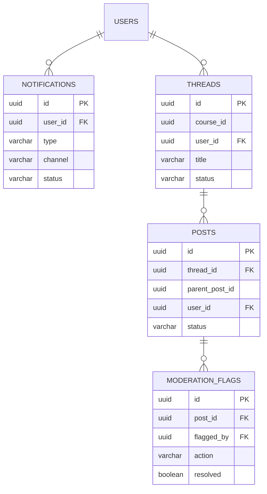

# Notification & Forum Data Models

> **Location:** `docs/architecture/notification_forum_design.md`  
> **Owner:** Dev B – Week 6, Day 1 (Plan & Design)  
> **Status:** Base ✔️ – ready for implementation

---

## 1  Notification Service

### 1.1 Relational Schema (PostgreSQL)

| Column | Type | PK | FK | Description |
|--------|------|----|----|-------------|
| `id` | `uuid` | ✅ |   | Notification ID |
| `user_id` | `uuid` |   | ✅ `users.id` | Recipient |
| `type` | `varchar(32)` |   |   | e.g. `NEW_MESSAGE`, `NEW_REPLY`, `SYSTEM` |
| `channel` | `varchar(16)` |   |   | `IN_APP`, `EMAIL`, `PUSH` |
| `title` | `varchar(120)` |   |   | Short headline (display & email subject) |
| `body` | `text` |   |   | Markdown‑enabled message body |
| `status` | `varchar(16)` |   |   | `QUEUED`, `SENT`, `READ` |
| `metadata` | `jsonb` |   |   | Arbitrary payload (thread‑id, post‑id, etc.) |
| `created_at` | `timestamptz` |   |   | Insert timestamp |
| `sent_at` | `timestamptz` |   |   | When the worker published the notification |
| `read_at` | `timestamptz` |   |   | When the user opened it (nullable) |

**Indexes**

```sql
CREATE INDEX idx_notifications_user_status
  ON notifications (user_id, status);
CREATE INDEX idx_notifications_created
  ON notifications (created_at DESC);
```

### 1.2 Email Queue (Redis)

* **Key pattern:** `email_queue` (FIFO list)  
* **Job payload (JSON):**

```json
{
  "notification_id": "uuid",
  "template_id": "welcome_email",
  "to": "student@example.com",
  "subject": "New reply to your thread",
  "merge_vars": { "name": "Alex", "threadUrl": "/forum/123" }
}
```

A lightweight worker pops jobs, renders MJML templates stored in **S3 `amadeus-email-templates/`**, and sends via SES/SendGrid.

---

## 2  Forum Service

### 2.1 Data Model

| Table | Purpose |
|-------|---------|
| `threads` | Top‑level discussion topics (one per lesson/course or general). |
| `posts` | All replies (flat or threaded via `parent_post_id`). |
| `moderation_flags` | Reports/flags placed on posts for moderator review. |

#### 2.1.1 `threads`

| Column | Type | PK | Description |
|--------|------|----|-------------|
| `id` | `uuid` | ✅ | Thread ID |
| `course_id` | `uuid` |   | Optional link to a course |
| `user_id` | `uuid` |   | Thread author |
| `title` | `varchar(140)` |   | |
| `body` | `text` |   | Markdown‑enabled first post |
| `status` | `varchar(12)` |   | `OPEN`, `LOCKED` |
| `created_at` | `timestamptz` |   | |
| `updated_at` | `timestamptz` |   | |

#### 2.1.2 `posts`

| Column | Type | PK | FK | Description |
|--------|------|----|----|-------------|
| `id` | `uuid` | ✅ |   | Post ID |
| `thread_id` | `uuid` |   | ✅ `threads.id` | |
| `parent_post_id` | `uuid` |   | ✅ `posts.id` | Enables nested replies |
| `user_id` | `uuid` |   | ✅ `users.id` | Author |
| `body` | `text` |   |   | Markdown content |
| `status` | `varchar(16)` |   |   | `VISIBLE`, `MODERATED`, `DELETED` |
| `created_at` | `timestamptz` |   |   | |
| `updated_at` | `timestamptz` |   |   | |

#### 2.1.3 `moderation_flags`

| Column | Type | PK | FK | Description |
|--------|------|----|----|-------------|
| `id` | `uuid` | ✅ |   | Flag ID |
| `post_id` | `uuid` |   | ✅ `posts.id` | Flagged post |
| `flagged_by` | `uuid` |   | ✅ `users.id` | User who reported |
| `reason` | `text` |   |   | Free‑text or enum |
| `action` | `varchar(12)` |   |   | `NO_ACTION`, `HIDDEN`, `DELETED`, `WARNED` |
| `resolved` | `boolean` |   |   | Default `false` |
| `resolved_by` | `uuid` |   | ✅ `users.id` | Moderator |
| `created_at` | `timestamptz` |   |   | |
| `resolved_at` | `timestamptz` |   |   | |

**Typical query**

```sql
-- Latest 20 visible posts for a thread
SELECT *
FROM posts
WHERE thread_id = $1
  AND status = 'VISIBLE'
ORDER BY created_at ASC
LIMIT 20;
```

### 2.2 Moderator Alert Flow

1. `PATCH /posts/:id/flag` inserts a row into `moderation_flags`.  
2. Service publishes Redis message `mod_alerts` with `{ post_id, reason }`.  
3. Notification Service creates an in‑app & email notification for users with role `MODERATOR`.  

---

## 3  Entity‑Relationship Diagram (Mermaid)



*(GitHub renders Mermaid automatically)*

---

## 4  OpenAPI Path Sketch

```yaml
# docs only – full spec will be in contracts/rest/notification_forum.yaml
paths:
  /notifications:
    post:
      summary: Create notification
  /notifications/{id}/read:
    patch:
      summary: Mark notification as read
  /threads:
    post:
      summary: Create thread
  /threads/{id}:
    get:
      summary: Get thread with posts
  /posts/{id}/flag:
    patch:
      summary: Flag a post for moderation
```

---

## 5  Future Work & Notes

* **Sharding:** if forum grows large, consider partitioning `posts` by `thread_id` hash.  
* **Soft‑deletes:** retain history for audit by marking `status = 'DELETED'`, not dropping rows.  
* **Email templates:** stored in S3, keyed as `templates/{locale}/{template_id}.mjml`.  
* **Redis key TTLs:** notifications in `QUEUED` status expire after 14 days if unsent.

---

📝 **Next Step:**  
• Scaffold `notification-service/` and `forum-service/` with these schemas using Prisma/Flyway.  
• Provision `infra/db/notifications.tf` and `infra/db/forum.tf` Terraform modules for the above tables.  
• Add `email_queue` & `mod_alerts` Redis resources in the same Terraform stack.
