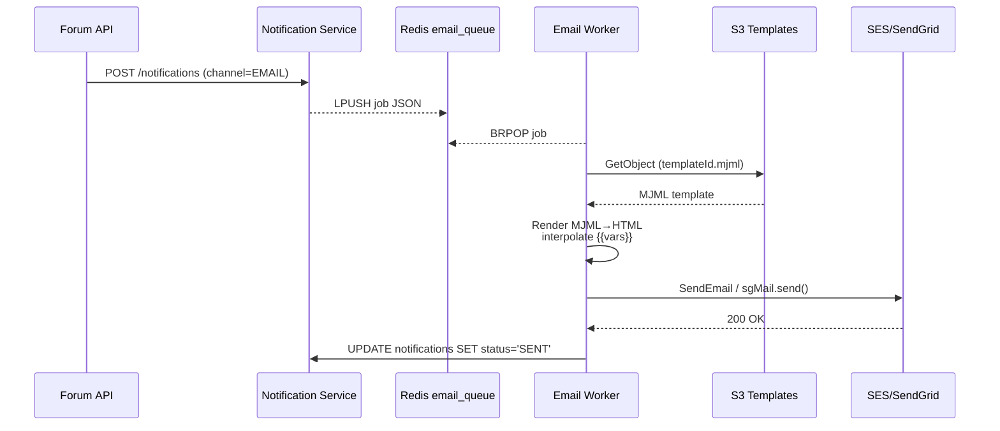

# Notification & Forum API Reference  
*Amadeus Education – Week 6 Dev B deliverable*

> **File:** `docs/notification_forum_API.md`  
> **Services:** `notification-service` · `forum-service`  
> **Status:** Base documentation complete

---

## 1 Notification Service

### Base URL

```
http://notification-service:3002
```

### 1.1 Create Notification

| Method | Path | Description |
|--------|------|-------------|
| `POST` | `/notifications` | Store a notification record; if `channel=EMAIL` pushes job to **Redis `email_queue`** |

**Request body**

```json
{
  "user_id": "11111111-1111-1111-1111-111111111111",
  "type": "FORUM_REPLY",
  "channel": "EMAIL",
  "title": "New reply to your thread",
  "body": "Alice replied: *Thanks!*"
}
```

**Response `201`**

```json
{ "id": "notification-uuid", "status": "QUEUED" }
```

### 1.2 Moderator Alert (internal)

| `POST` | `/moderator-alert` | Called by Forum service when a post is flagged |

```json
{
  "title": "Post flagged for moderation",
  "body": "Post 123 flagged: spam",
  "metadata": { "post_id": "123" }
}
```

Reads comma‑separated `MODERATOR_IDS` env var to decide recipients.

---

## 2 Forum Service

### Base URL

```
http://forum-service:3003
```

### 2.1 Create Thread

| `POST` | `/threads` |

```json
{
  "user_id": "user‑uuid",
  "title": "How do I balance redox?",
  "body": "Here is my attempt..."
}
```

### 2.2 Reply to Thread

| `POST` | `/threads/{threadId}/reply` |

```json
{
  "user_id": "another‑uuid",
  "body": "Try the half‑equation method!"
}
```

Optional `parent_post_id` to nest replies.

### 2.3 Get Thread

| `GET` | `/threads/{threadId}?limit=20&offset=0` |

Returns:

```json
{
  "thread": { ... },
  "posts": [ { ... } ]
}
```

### 2.4 Flag Post for Moderation

| `PATCH` | `/posts/{postId}/flag` |

```json
{
  "flagged_by": "user‑uuid",
  "reason": "spam / inappropriate"
}
```

Creates a `moderation_flags` row and triggers `/moderator-alert` in Notification service.

### 2.5 Delete Post (soft)

| `DELETE` | `/posts/{postId}` | Sets `status = 'DELETED'` |

---

## 3 Email‑Template Workflow



**Key points**

1. **Templates** live at `s3://amadeus-email-templates/templates/{templateId}.mjml`  
2. First HTML comment defines the **subject** line (`<!-- Subject: ... -->`).  
3. Merge variables (`{{name}}`, `{{threadUrl}}`, etc.) are replaced before MJML compilation.  

---

## 4 Environment Variables

| Service | Variable | Purpose |
|---------|----------|---------|
| Notification | `EMAIL_TEMPLATE_BUCKET` | S3 bucket name (default `amadeus-email-templates`) |
| Notification | `SENDGRID_API_KEY` | Use SendGrid when set, else AWS SES |
| Notification | `MODERATOR_IDS` | Comma‑sep UUID list receiving moderator alerts |
| Forum | `NOTIF_SERVICE_URL` | Base URL of Notification service |

---

## 5 Changelog

| Version | Date | Notes |
|---------|------|-------|
| 0.1.0   | 2025-06-28 | Initial spec incl. moderator alerts & email workflow |

---

**Next:** keep this doc synced when adding pagination, search, or new notification types.
